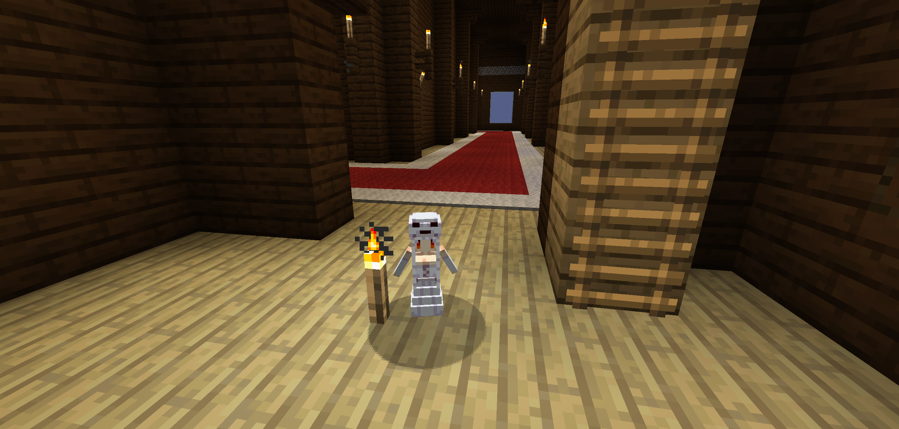

# Tiny Ghasts
This mod added cute tiny (sad) ghasts that'll fight for you!

## Screenshot

(This screenshot is taken with resource pack [Cute Mob Models RP](https://www.curseforge.com/minecraft/texture-packs/cute-mob-models-resource-pack) installed! Make sure to check it out! It'll automatically use the render for ghast, so all texture/model applied to normal ghast will apply to tiny ghasts as well!)

## Features
 - It can be tamed with cake by chance, so make sure store ton of cake before trying to tame one!
 - It'll follow you and fight for you! Every 4 seconds a fireball will be fired! A tiny ghast has 25% chance to fire a snowball that'll deal 2 heart damage and apply 4 secs of slowness also set it freeze for 8 secs + min freeze ticks and 75% chance to fire a fireball that'll deal half a heart damage and set it on fire for 2 secs!
 - Once a tamed tiny ghast's health dropped below zero, it'll freeze and become invincible. Use a lava bucket to revive it!
 - If you are too far away from it or in another dimension, it'll teleport to you, so no need to worry about it getting lost!
 - Tiny ghasts will spawn rarely in nether now, follow the same rule as ghasts!(untested, at least I'm not lucky enough to get one to spawn, use command to summon one if needed)
 - There're also tiny ghast spawn eggs available for you to grab! It's in the spawn egg item group, just after normal ghast spawn eggs!
 - All tiny ghasts uses the same renderer as vanillia ghasts, so feel free to apply any resource packs and the effect will apply to tiny ghasts too!(Personally I would recommand [Cute Mob Models RP](https://www.curseforge.com/minecraft/texture-packs/cute-mob-models-resource-pack) and the hit box is adjusted to fit it's model as well!)

## Supported Version
Currently only 1.21.5 is officially supported! May add support for later version!

## Todos
 - Code cleaning!
 - Tameable amount limitation: Currently you can tame unlimited amount of tiny ghasts, but wont that be too powerful? I may add a limition later, a dynamic limition depending on the game difficulty and game mode would be a great idea!(research still needed)
 - Bug fix: currently if the player died in nether or end and respawn in overworld, then the tiny ghasts wont be able to teleport to the player anymore.

## License
[AGPLv3](LICENSE)!

## AI Usage
This repo DO contain AI generated(or I would like to say, assisted, but whatever) code, so use at your own caution!
